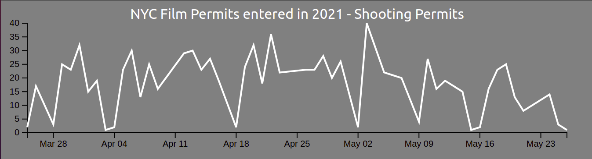

# Data Visualization with Reactjs and D3js

This project is a series of experiments using Reactjs and D3js.

## Part I: Line Graph

App is setup via create-react-app and npm install d3.\
This Line Graph provides a visual representation of 'NYC filming permits 2021' in JSON format from the [City of New York](https://data.cityofnewyork.us/resource/tg4x-b46p.json)

### `Import Data`

Fetch the JSON data through the NYC api endpoint via useEffect hook.\
Filter and transform the data into a suitable format for the end-user.

### `Visualize`

Present the data for the user in a clear and uncomplicated visual form:

- set up svg and chart refs
- set up x and y scales
- call the axis
- set up path and/or shape
- add text

### `Sample`

## Part II: Bar Graph

Create a Responsive Data Visualization.\
The Bar Graph provides a visual representation of 'NYC filming permits 2021' in JSON format from the [City of New York](https://data.cityofnewyork.us/resource/tg4x-b46p.json)

### `Import Data`

Fetch the JSON data through the NYC api endpoint via useEffect hook.\
Filter and transform the data into a suitable format for the end-user.

### `Visualize`

Present the data for the user in a clear and uncomplicated visual form:

- set up svg and chart refs
- set up x and y scales
- call the axis
- set up path and/or shape
- add text

### `Sample`

